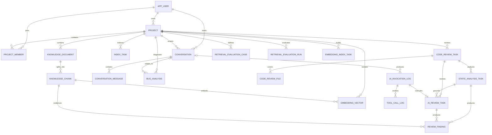
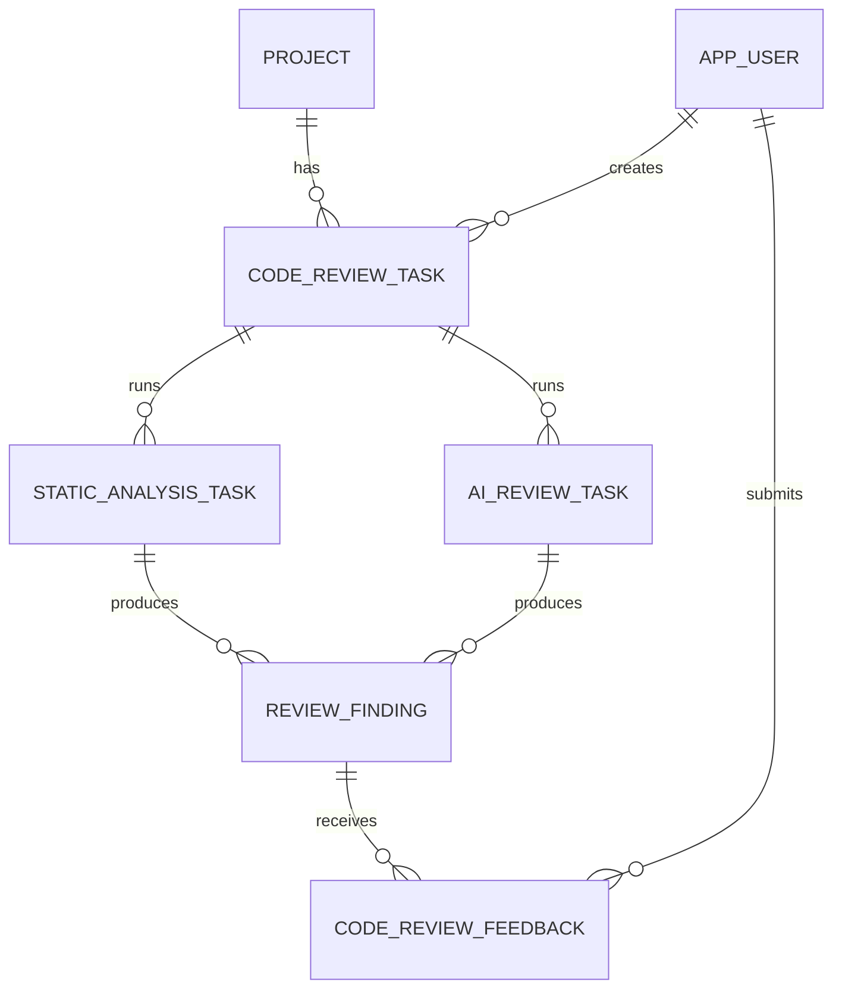

# DevMate AI 数据库设计

## 1. 设计目标

第一版数据库需要支撑这条完整业务链路：

```text
用户创建项目
  → 导入源码或文档
  → 创建索引任务
  → 解析为知识块
  → 写入向量存储
  → 用户发起会话
  → Agent 调用检索/诊断工具
  → 记录回答、耗时和工具链路
```

MySQL 负责结构化业务数据和关联关系。V9 增加 `embedding_vector` 作为开发阶段的小规模向量存储适配器，并由 `knowledge_chunk.vector_id` 指向当前成功向量。它使用 Java 线性余弦搜索完成端到端验证，不是生产级 ANN；数据规模增长后可替换为 Elasticsearch 或专用向量数据库。V10 增加独立 AI 审查任务和证据引用，不把模型调用状态混入确定性静态分析任务。

## 2. 表关系



## 3. 核心表

### 3.1 `app_user`

保存登录用户。表名不使用 `user`，避免与不同数据库的关键字冲突。

关键字段：

- `username`：唯一登录名。
- `password_hash`：只存密码哈希，不存明文密码。
- `status`：`ACTIVE`、`DISABLED`、`LOCKED`。
- `deleted`：逻辑删除标记。

### 3.2 `project`

保存接入 DevMate AI 的研发项目。

关键字段：

- `owner_id`：项目所有者。
- `source_type`：`LOCAL`、`GIT`、`UPLOAD`。
- `source_location`：本地路径、Git 地址或上传文件引用。
- `current_revision`：当前已导入的提交哈希或版本号。
- `status`：`CREATED`、`INDEXING`、`READY`、`FAILED`。
- `last_indexed_at`：最近成功完成知识库构建的时间。

`owner_id` 在 V2 中暂时允许为空，是为了让已有 V1 数据能够平滑升级；项目创建业务会要求所有者必填，后续完成存量回填后再通过迁移增加非空约束。

### 3.3 `project_member`

表示用户与项目之间的权限关系。

- 同一用户在同一项目只能有一条成员记录。
- `member_role` 可取 `OWNER`、`MAINTAINER`、`DEVELOPER`、`VIEWER`。
- 后续所有检索和 Tool 调用都应先校验该关系。

### 3.4 `knowledge_document`

保存源码文件或技术文档的元数据，不在这里保存文件本体。

- `source_kind`：当前使用 `SOURCE_CODE`、`CONFIGURATION`、`DATABASE_SCHEMA`，后续文档扩展 `README`、`TECH_DOC`、`API_DOC`。
- `content_hash`：判断文件内容是否变化，用于增量更新。
- `path_hash`：文件路径的 SHA-256，用于建立定长唯一索引；完整路径仍保存在 `file_path`。
- `revision`：文件所属的 Git 提交或导入版本。
- `package_name`：Java 文件的包名，由 AST 解析得到。
- `status`：当前结构解析使用 `PARSED`；完成向量索引后使用 `INDEXED`，失败使用 `FAILED`。
- `(project_id, path_hash, revision)` 唯一，防止同一版本重复导入，同时避免 `utf8mb4` 长路径超过 MySQL 的索引长度限制。

### 3.5 `knowledge_chunk`

RAG 的最小检索单元。

- `chunk_type`：Java 使用 `CLASS/CONSTRUCTOR/METHOD`，配置使用 `CONFIG_PROPERTY`，数据库上下文使用 `DATABASE_TABLE/COLUMN/INDEX/CONSTRAINT/CHANGE`。
- `symbol_name`：类名、方法签名、配置键或规范化数据库对象名。
- `start_line`、`end_line`：用于回答时给出源码位置。
- `content_hash`：去重和增量索引。
- `vector_id`：向量数据库中的记录 ID。
- `metadata_json`：保存注解等可扩展符号元数据，避免每增加一种 AST 属性就修改表结构。
- `project_id` 是有意保留的冗余字段，用于高频项目隔离过滤，避免每次检索都连接文档表。

### 3.6 `index_task`

记录代码解析和知识库构建任务。

- `task_type`：`FULL`、`INCREMENTAL`、`DELETE`。
- `status`：`PENDING`、`RUNNING`、`SUCCEEDED`、`FAILED`。
- 文件计数用于展示进度。
- 后续接入 RabbitMQ 时，任务 ID 同时作为幂等依据之一。

### 3.7 `embedding_vector` 与 `embedding_index_task`

V9 增加可替换的向量索引实现：

- `embedding_vector` 绑定项目、Chunk、revision、provider、模型、维度与内容哈希。
- 复合唯一约束防止相同 Chunk 和模型版本重复写入。
- `vector_json` 仅用于小规模开发与测试；Java 侧设置扫描上限并明确返回是否截断。
- `embedding_index_task` 保存索引总数、成功、跳过、失败和脱敏错误，支持失败后续建。
- 远端模型调用不处于数据库长事务；每个批次保存使用独立短事务。
- 新 revision 或模型版本不会复用不兼容向量。

### 3.8 `conversation` 与 `conversation_message`

会话和消息分表，而不是把一次问答放在同一行：

- 支持多轮对话以及 Tool 消息扩展。
- `message_role` 可取 `SYSTEM`、`USER`、`ASSISTANT`、`TOOL`。
- `(conversation_id, sequence_no)` 保证消息顺序唯一。
- Token 字段记录在 AI 回复消息上，便于按会话统计。

### 3.9 `bug_analysis`

保存一次可独立查看的 Bug 诊断任务和结果。

- 原始异常保存在 `error_log`。
- 分析结果保存在 `analysis_result`。
- `severity`：`UNKNOWN`、`LOW`、`MEDIUM`、`HIGH`、`CRITICAL`。
- 可关联产生本次分析的会话。

### 3.10 `ai_invocation_log`

记录一次模型调用的运行指标和错误信息。

- 不保存完整 Prompt 和模型回答，避免敏感源码被重复写入审计表。
- `trace_id` 串联一次用户请求中的模型和工具调用。
- Token、耗时、模型和状态支持后续性能与成本分析。
- V10 增加 `prompt_version` 和 `request_hash`，用于复现配置与比对请求，但不保存完整 Prompt。

### 3.11 `tool_call_log`

记录 Agent 每次工具选择和执行结果。

- `arguments_summary` 和 `result_summary` 只保存脱敏摘要。
- 通过 `invocation_id` 还原一次 Agent 请求的工具调用链。
- 可统计各工具的成功率和延迟。

### 3.12 `retrieval_evaluation_case` 与 `retrieval_evaluation_run`

V8 增加可复现的检索评测：

- 用例固定 `dataset_version`、问题、预期文件、可选预期符号和 `top_k`；
- 同一项目、数据集版本和用例名称唯一，防止重复样本改变指标权重；
- 运行记录绑定项目 revision 和检索配置版本；
- 保存宏平均 Recall@K、Precision@K、HitRate@K、MRR 和不含源码正文的逐用例结果；
- 未在当前 revision 建立索引的预期项单独标记，不混入有效用例指标。

## 4. 为什么暂时不建这些表

- 专用向量库 Schema：当前通过适配层使用 MySQL 小规模验证，替换为目标向量存储时再按其索引能力设计。
- Redis 会话表：Redis 是缓存，不是事实数据源。
- MQ 消息表：先完成同步闭环；接入可靠消息时再根据方案设计 Outbox。
- 微服务独立数据库：当前是模块化单体，过早分库会增加事务和联调成本。

## 5. 代码审查表

V4/V5 已增加 Diff 任务和基准、目标版本覆盖清单；V6 已增加静态分析任务和第一版统一 Finding；V10 增加 AI 审查任务和语义 Finding 字段。反馈表将在评测阶段创建。

### `code_review_task`

保存一次代码审查任务：

- 所属项目、创建用户
- 基准版本和目标版本
- 审查范围与触发方式
- 任务状态和失败原因
- 变更文件数、问题数和执行耗时
- 使用的模型、Prompt 版本和规则集版本

当前 V4 先落地 Diff 阶段所需字段：关联索引任务、基准/目标 revision、状态和覆盖计数。模型与规则版本在 AI 审查迁移中补充。

### `code_review_file`

保存每个变更文件的可审计覆盖结果：

- 新旧路径与 `ADD/MODIFY/DELETE/RENAME/COPY`
- 新增、删除行数，以及基准和目标版本行区间
- `FULL/PARTIAL/SKIPPED` 覆盖状态
- 映射到的 AST 符号和跳过原因

### `static_analysis_task`

保存一次确定性工具执行：

- 关联项目和 Diff 审查任务；
- 保存工具名称、版本、状态、分析文件数和问题数；
- 外部执行失败时保存脱敏错误和完成时间。

### `ai_review_task`

保存一次独立的模型审查执行：

- 固定 `review_task_id`、`static_analysis_task_id` 和目标 revision，防止执行期间被新提交切换上下文；
- 保存 provider、model、Prompt 版本、检索配置和实际检索模式；
- `running_key` 只在 RUNNING 状态存在，唯一键承担同一 Diff 并发幂等保护；完成、失败或超时回收时由显式 SQL 置空；
- 保存上下文 Chunk、有效 Finding、拒绝 Finding 和脱敏错误计数；
- 通过 `invocation_id` 关联 Token、耗时和错误类别。

### `review_finding`

保存一条结构化审查问题：

- 文件、起止行号和代码符号
- `path_hash`：对长路径建立定长索引，避免 `utf8mb4` 索引长度超限
- 问题分类、严重程度和置信度
- 标题、证据、风险场景、建议和验证方法
- 来源：`STATIC` 或 `LLM`；后续工具和模型共同确认时可扩展 `HYBRID`
- 去重指纹和当前处理状态
- AI Finding 额外绑定 `ai_review_task_id/chunk_id`，并保存事实/推断/待验证、置信度、风险场景、建议和验证方法；
- 模型只提供 Chunk 引用，文件和行号来自服务端证据元数据。

### `code_review_feedback`

保存开发者对 Finding 的反馈：

- 采纳、驳回、误报或稍后处理
- 反馈说明和操作用户
- 用于评测和后续规则、Prompt 优化

计划关系：



`review_finding` 已在 V6 创建；`code_review_feedback` 将在审查反馈与评测阶段通过新迁移创建。

### `code_reference`

保存当前源码版本中的确定性关系证据：

- `source_chunk_id`：引用所属的类或方法；
- `target_chunk_id`：能够唯一解析时关联目标方法，无法证明时为空；
- `reference_kind`：方法调用、数据访问、配置键/前缀或实体到数据库表的映射；
- `reference_name/qualifier/argument_count`：解析和展示所需的调用事实；
- `start_line/end_line`：由 AST 得到的真实源码位置；
- `revision`：关系只能在相同项目版本内使用。

数据访问命名识别只用于补充上下文，不直接作为 Finding。目标 Chunk 删除时外键将关联置空，来源 Chunk 删除时引用随之删除。

## 6. 数据库版本管理

- `V1__initialize_core_schema.sql`：初始项目表。
- `V2__add_agent_knowledge_schema.sql`：用户、权限、知识库、会话、Bug、AI 和 Tool 审计表。
- `V3__add_java_structure_metadata.sql`：Java 包名和符号扩展元数据。
- `V4__add_code_review_diff_schema.sql`：Diff任务与文件覆盖清单。
- `V5__add_base_diff_line_ranges.sql`：保存基准版本删除行区间。
- `V6__add_static_analysis_schema.sql`：静态分析任务与统一 Finding。
- `V7__add_code_reference_graph.sql`：方法调用、配置与数据访问关系图。
- `V8__add_retrieval_evaluation_schema.sql`：固定检索评测用例、运行版本和质量指标。
- `V9__add_embedding_vector_schema.sql`：向量索引任务、模型版本隔离和开发阶段向量存储。
- `V10__add_ai_review_schema.sql`：AI 审查任务、调用版本审计和结构化语义 Finding。
- 已执行的迁移文件不再修改；后续每次变更新增版本脚本。

本地默认使用 H2 的 MySQL 兼容模式执行相同迁移；提交前至少运行 `./mvnw test`。涉及 MySQL 专属 SQL 时，还需要使用 `local` Profile 在 MySQL 环境补充验证。
